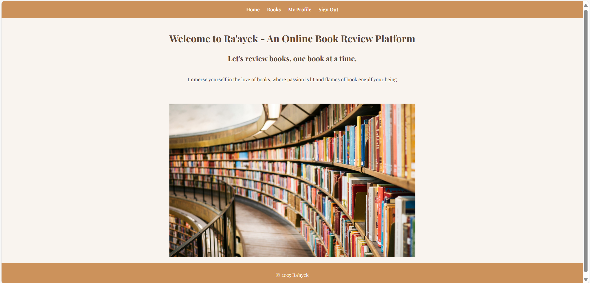
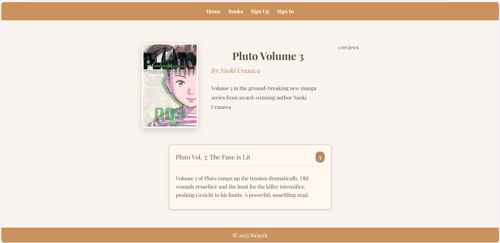
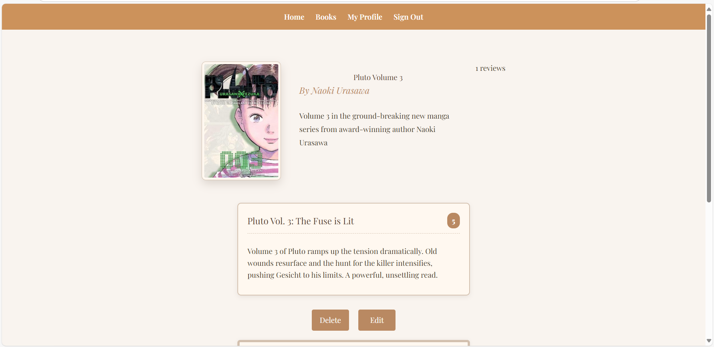
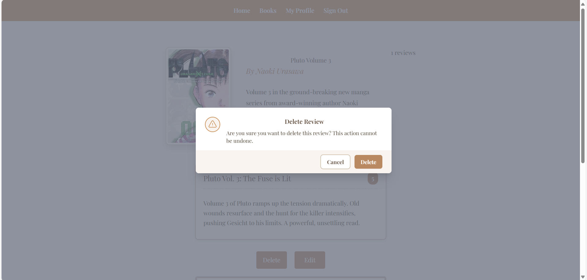
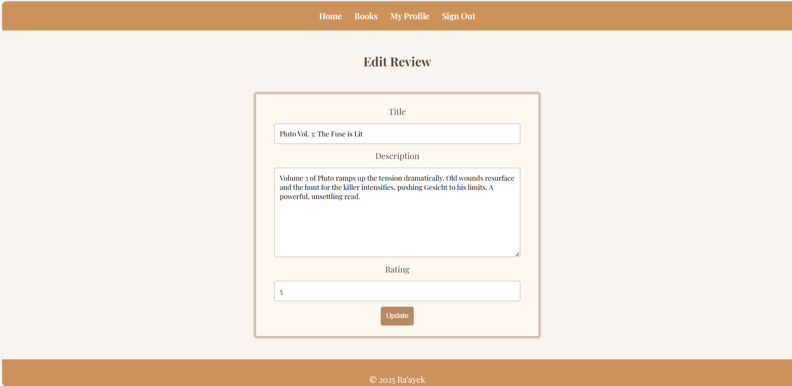

# Ra’ayek – Online Book Review Platform

A full-stack web app where users can browse books and read community reviews. Logged-in users can also post and delete their own reviews.

Tailored for readers who want to discover new books and share thoughts without the clutter of giant platforms like Goodreads.

---

## Screenshot

  

---

## App Name & Purpose

**Ra’ayek**  
A lightweight review system built using the MEN stack and styled with TailwindCSS.

### Features
- A minimal interface for book lovers  
- An easy way to read and write reviews  

### Why this app?
We built Ra’ayek to practice working with dynamic routes, RESTful APIs, and CRUD operations — all while keeping the UX clean.

---

## Getting Started

### Deployed App  
> [Ra’ayek on Render](https://online-book-review-platform.onrender.com)

### Planning Docs  
- [**User Stories**](https://imgur.com/a/I3MC8u0)  
- [**ERD**](https://imgur.com/a/SDTIGlu)

---

## Technologies Used

| Layer     | Tech                     |
|-----------|--------------------------|
| Frontend  | HTML + EJS               |
| Styling   | TailwindCSS  + CSS       |
| Backend   | Express.js               |
| Database  | MongoDB (via Mongoose)   |
| Server    | Node.js                  |

---

## Features

- View detailed book info (cover, description, author)  
- List user reviews with ratings  
- Modal-based delete confirmation  
- Only review authors can delete  
- Fully responsive design  

---

## Attributions

- Fonts & Styling: Tailwind CSS  
- Hosting: Render  

---

## Next Steps

Here’s what we’d like to implement next:
- Book search & filtering  
- Rating summary or average score  
- Better UI/UX design
